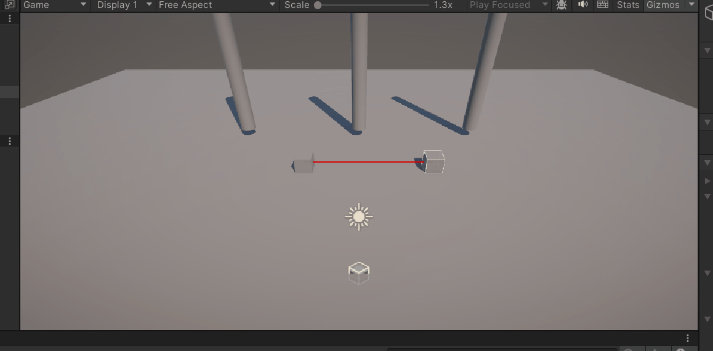
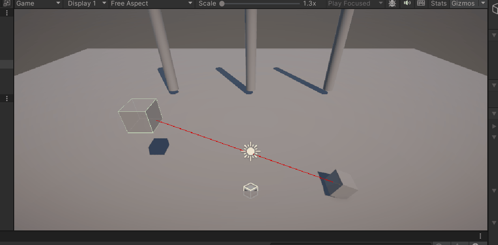
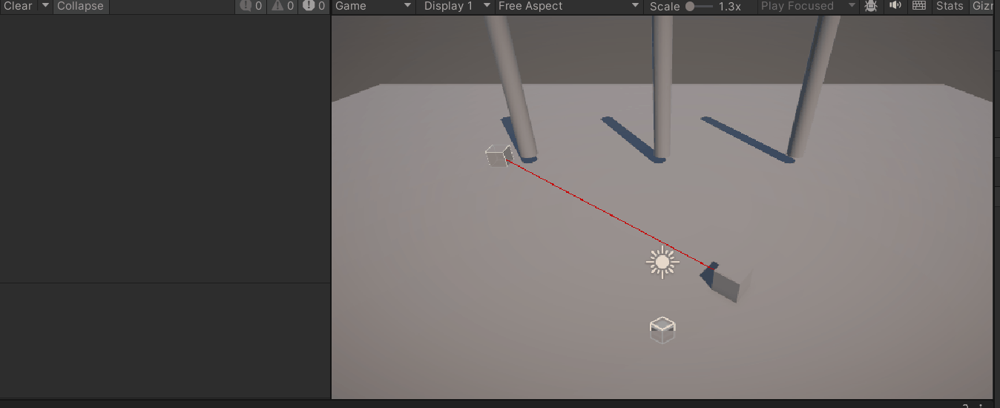

# FDV_P2

Segunda práctica en Unity de Fundamentos de Desarrollo de Videojuegos. Movimiento Rectilíneo Uniforme y Trigger en Unity
En esta ocasión se cuenta con varios objetivos a desarrollar con el fin de familiarizarse con el MRU en Unity. Para ello se aplican tres scripts que permiten:
 - Mover un objeto mediante los inputs de movimientos.
   
 - Mover un objeto hacia un punto fijo (Posteriormente siguiendo a otro).
  
 - Activar un Trigger mediante entre dos gameObject.
   
